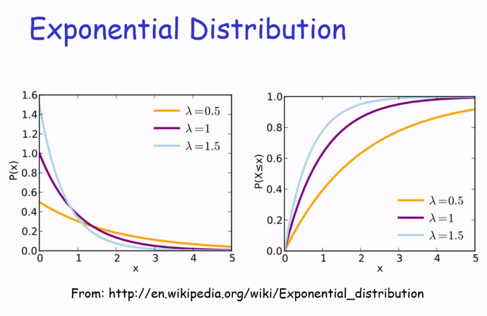
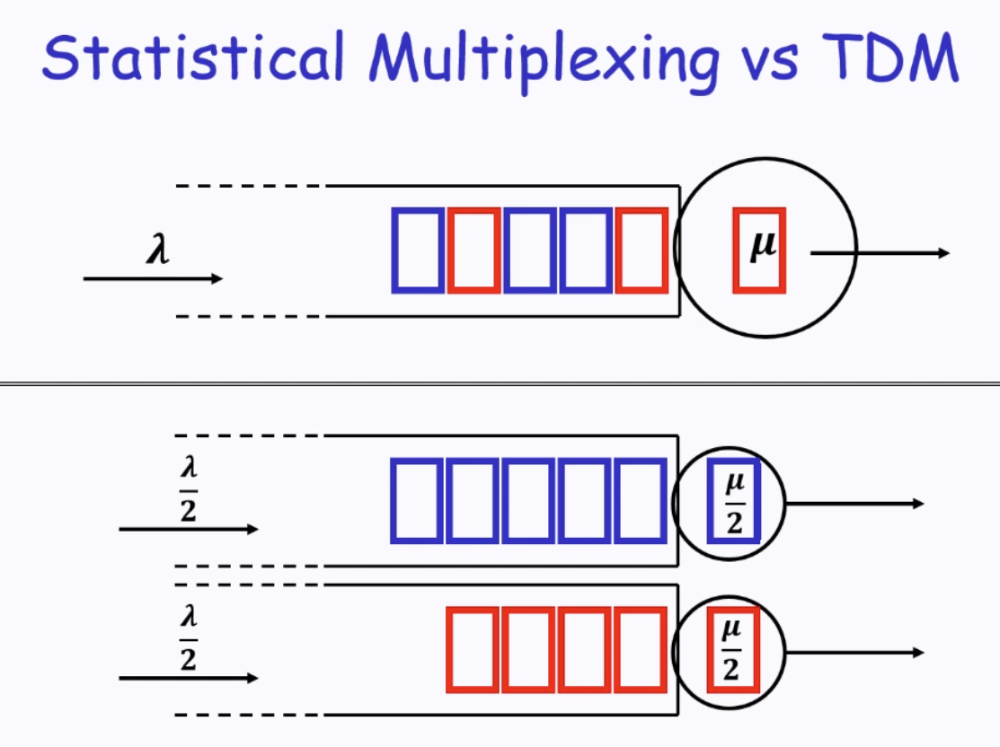

# CS4226 Chapter 2: Network Queueing Models

## Modelling the Packet Flow: Arrival Pattern

```
|  x    x         x     |
|  t1   t2        t3    |
|  <-T1--><---T2--->    |
```

- Arrival time t<sub>i</sub>
- Inter-arrival time T<sub>i</sub> = t<sub>i+1</sub> - t<sub>i</sub>
- Model inter-arrival times by **independent** and **identically distributed** random variable T

Bus analogy
- Arrival: Bus arrival Time
- Inter-arrival time: time between 2 busses

## Back to statistics

### Random Experiment

- Sample Space S
    - Set of all outcomes
- Event E
    - A subset of the sample space
- Probability P(E)
    - P(E) ∈ [0,1]
    - P(S) = 1
    - For any sequence of E<sub>1</sub>, E<sub>2</sub>, ... mutually exclusive events:
        - $P(\bigcup_{i=1}^{\infty}E_i) = \sum_{i=1}^{\infty}P(E_i)$

### Random Variable

Random variable **X**
- Function that assigns a real value to each outcome `s ∈ S`
- **Distribution function** F of the random.var X is defined as:
    - `F(X) = P{X <= x} = P(X<sup>-1</sup>((-inf, X)))`
- A random variable is continuous if there exists a probability density function s.t.
    - `f(x) is defined as d/dx(F(x))`
    - (a.k.a cdf is differentiable)

Independence
- 2 random vars are independent if f<sub>x,y</sub> = f<sub>x</sub>(x) f<sub>y</sub>(x)

Expected Value / Mean
- $\sum_{x=-\infty}^{\infty}xP(X=x)$ or $\int_{-\infty }^{\infty}xf(x)dx$

### Exponential Distribution

T ~ Exponential($\lambda$) if for x >= 0:
- $f(x) = \lambda e^{-\lambda x}$
- $F(x) = P(T \le x) = 1 - e ^ {-\lambda x}$

$E[X] = \int_{-\infty}^{\infty}xf(x)dx = \frac{1}{\lambda}$

What does $\lambda$ mean?
- Rate parameter
    - Average number of events per unit time
- Thus, $\frac{1}{\lambda}$ = average waiting time between events

Applicable in this situation because of the memoryless property
- $P(T > s + t | T > s) = P(T > t)$



- Left: Lambda higher -> higher arrival rate -> More likely (P(x)) that the waiting time (x) is shorter
- Right: Lambda higher -> More likely that a new event arrives by a certain time (X <= x)

## Modelling the Packet flow: Poisson Process

```
|  x    x         x     |
|  t1   t2        t3    |
|  <-T1--><---T2--->    |
```
- $T_i$ s are independent, identically distributed (**iid**) random vars.
    - $T_i \sim Exponential(\lambda)$
- Arrival pattern is called a Poisson Process
- Poisson is a good model because:
    - Memoryless property: Starting time doesn't matter
    - Merging 2 Poisson processes with $\lambda_1$ $\lambda_2$ creates a new poisson process with $\lambda = \lambda_1 + \lambda_2$
        - Important property as that means a merged distribution is still memoryless


Exponential vs Poisson
- Exponential: Time between 2 events
- Poisson: P(number of events occuring at a certain time)
## Modelling the Packet flow: Service Time

Packets have varying lengths
- Different amount of time needed to process
    - Same packet under different link capacity / rates
    - Different packets under same rates

- Service time $S_i$
    - Follows i.i.d rand.var S with $E[S] = \frac{1}{\mu}$


## M/M/1 Model

### Overview
```
              _ _ _ _ _ _     _
   λ         | | | | | | |   |μ|
 ----->      |_|_|_|_|_|_|   |_| ----->
 packet           queue      networking device
```

- Single server with infinite queue size
- Poisson arrival with rate $\lambda$
- Exponential i.i.d service time with rate $\mu$
- Arrival and service times are independent
- FIFO service discipline (a.k.a queue)

### Main Result

Utilization $\rho$:
- Percentage of time that the "server" is busy
- === Probability that a random observation finds server busy
- A general result
    - $\rho = \frac{\lambda}{\mu}$
    - $ \lambda < \mu$ for system stability
        - Arrival rate < service rate
        - So that queue does not build infinitely
    - Understanding $\rho$
        - If $\rho$ = 0.7, server is busy 70% of the time
        - If $\rho \geq 1$: System is unstable.
        - Queue size might still grow to infinity (As arrival time follows exponential distribution)

- $\rho$ in Little's Law : $\rho = \frac{\lambda}{\mu}$ = $\lambda E[S_i]$
- $\rho$ = L, W = $E[S_i]$, $\lambda = \lambda$
    - Average number of packets in the system
    - $(P(0 packet) * 0 + P(1 packet) * 1)$
    - This link only can process up to 1 at a time (so L is between 0,1 for stable systems)

### Birth-Death Process

```
  λ    λ    λ    λ             λ
 ---> ---> ---> --->          --->
0    1    2    3    4   ...  n    n+1
 <--- <--- <--- <---          <---
  μ    μ    μ    μ              μ
```
- State Transition diagram for M/M/1 System
- Define system state L as the (random) number of uers in the ssytem.
- Transition to a new state: Rate of that event happening under the current state.
    - States are in steps of 1
        - μ and λ simply denote how quickly these steps happen (e.g higher λ means more arrivals to the queue, so the increase step occurs more often)

#### Main Result

$\pi_i$: Percentage of time that exactly $i$ packets or customers in the system (e.g server + queue)
- Also the probability that $P(L = i)$ that a random observation finds $i$ packets in the system.
- For M/M/1 system, $\pi_i = P(L=i) = \rho^i(1-\rho)$
- Follows a geometric distribution (which is memoryless!)

### M/M/1
Server + Queue
- Average # of packets in the system = $E[L] = \frac{\rho}{1-\rho}$
- Average sojourn time of packets = $E[W] = \frac{1}{\mu - \lambda}$

Queue:
- Average # of packets in the queue = $E[Q] = \frac{\rho^2}{1-\rho}$
- Average queueing delay of packets: $E[D] = E[W] - \frac{1}{\mu}$

Through this observations, we prove that $\lambda = \mu$ is unstable, as $E[W]$ and $E[L]$ approaches infinity.

#### Relation to Throughput
- In a stable system, $\lambda$.
- Max possible rate $\mu$
    - How high it can go before instability
- Effectively min($\lambda, \mu$)

### Notations (a review)

- Times:
    - time $t$
    - arrival time $t_i$
    - sojourn time $W_i = t_i^d - t_i$
        - In a queueing system:
            - $W_i = D_i + S_i$
                - (D = queueing delay, S = service time)

- Numbers:
    - \# of packets / jobs / users $L(t)$
    - in a M/M/1 queueing system: $E[L] = E[Q] + E[X]$
        - mean no. of packets in system = in queue + in server
        - $E[X] = P[X=0] * 0 + P[X=1] * 1 = P[X=1]$ (utilization of server)

- Rates:
    - arrival rate $\lambda$
        - as a deterministic limit: $lim_{t \to \infty} \frac{N(t)}{t}$
        - as a function of random variable: $\frac{1}{E[T]}$
    - service rate $\mu$
        - defined in a queueinjg system as $\frac{1}{E[S]}$ (expected service time)


### Effective Bandwidth

- Physical link capacity
    - e.g 10 Mbps cable
    - Upper theoretical processing limit of hardware
- Effective bandwidth of a link
    - Actual throughput that can be achieved
    - Also depends on quality of service achieved

- For an M/M/1 system?
    - Maximum Achievable throughput
        - Utilization is below some $\rho$ ?
        - Average queueing delay is bounded by $D$ ?

### Statistical Multiplexing vs TDM (Time divisible multiplexing)


- Analogy of queueing for a restaurant (SM) vs restaurant that only takes reservations (TDM)
    - TDM: "Half of the time I serve blue, other half I serve red"
        - $\frac{\mu}{2}$ per "reservation" 

- Allocating each Poisson stream its own queue or a shared single queue
    - $(\frac{\lambda}{k}, \frac{\mu}{k})$ vs $({\lambda}, {k})$
    - We observe that utilization $\rho$ is actually the same (k cancels out)
        - Each sub server is as busy as the aggregate system