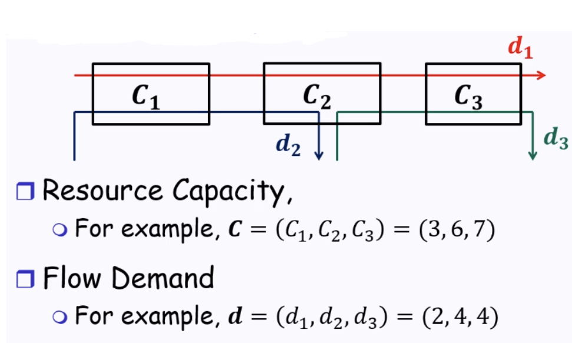
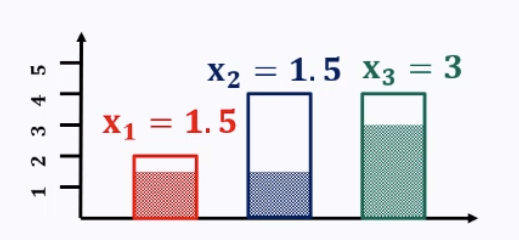

# Resource Allocation

Totally deterministic - no probability models

## Effective Bandwidth

- $E[W] = \frac{1}{\mu - \lambda}$
    - Expected waiting time (soujourn time)
- More capacity
    - Accomodates higher throughput
    - Lower delay
- Positive correlation of delay and throughput
- Given delay guarantee, achieved throughput:
    - $\lambda = \mu - \frac{1}{E[W]}$
    - just a rearrangement of the above

- Consider 2 packet flows going through a link
    - flow 1 has rate $\lambda_1$ packet/s
    - flow 2 has rate $\lambda_2$ packet/s
    - link has rate $\mu$ packet/s
    - What if we divide capacity into $\mu = \mu_1 + \mu_2$ and serve 2 flows separately?
        - Packets from flows might have different average delays
            - If we allocate more resources to a certain flow, delay of that flow will reduce
                - But other flow will experience more delay
    - What if we want to guarantee delays?
        - We bound $\lambda_1$ + $\lambda_2$ 
            - "Control how much traffic from each flow we want to accept"
            - Resource allocation of aggregate $\lambda$

## Motivation

- Internet provides best-effort service
    - No packet delivery guarantee
        - Suitable for elastic traffic
            - e-mail (SMTP), file download (FTP), dns
            - More tolerant to delay (e.g an e-mail taking 1 minute instead of 30 seconds isn't that bad)
        - Bad for real-time applications
            - Video streaming, voice calls
            - Service quality (e.g delay) is important
    - Solution: Allocate different resources to different application flows

## Fairness

- Equal share of resources
    - Divide capacity equally by number of flows
    - If bandwidth demand is smaller than this value, distribute to other flows
    - Consider capacity = 10
        - ${3,4,5,6} => fairness => {2.5, 2.5, 2.5, 2.5}$
        - ${1,4,5,6} => fairness => {1, 3, 3, 3}$
    - Intuition: small demand get all they want, large demand gets even split

### Fairness Example

- **Feasible Solution** $x = \{x_1, x_2, x_3\}$ such that
    - $\forall i, 0 \leq x_i \geq d_i$
    - $x_1 + x_2 \leq C_1, x_1 + x_2 + x_3 \leq C_2, x_1 + x_3 \leq C_3$ (allocation to all the flows will not exceed capacity of links they go through)
- Equal share principle
    - $C_3$ is not a bottleneck
        - Aggregate demand < Link capacity
    - Fair share at $C_2$ is $x_1 = x_2 = x_3 = 2$ (equal share principle)
    - Fair share at $C_1$ is $x_1 = x_2 = 1.5$
        - Wasteful as flow 1 and flow 2 will **NOT** be able to completely utilize the capacity that they are allocated (2 mbps) as they are capped by $C_1$ (1.5mbps)
        - Instead, we allocate $C_2$ such that $x_1 = 1.5, x_2 = 1.5, x_3 = C_2 - (x_1 + x_2) = 3$
            - The equal share principle is still followed
            - No wastage
            - Actually called **Max-Min Fairness**

- **Max-Min Fairness**
    - A feasible allocation $x$ is max-min fair **iff**:
        - Increase of any rate within the feasible domain must be at the cost of a decrease of an already smaller or equal rate
            - When you deviate from it, something unfair happens
                - Taking from a flow that already has less than or equal to what you have.
    - In math terms: $x$ is max-min fair if for any feasible $y$, if $y_i \gt x_i$, then $\exists j$ such that $y_j \lt x_j \leq x_i$
        - If you can give more capacity to another flow, but without decreasing, that means the original allocation does not fully utilize capacity
    - Question: must there always exist a max-min fair solution?
        - Short answer: there always exists a unique max-min solution

## Bottleneck Resource

- Resource $r$ is a bottleneck for flow $i$ iff
    - $r$ is saturated
    - $i$ has maximum rate among all flows using $r$
        - "If bottleneck gets more, it will affect those that get less than bottleneck"
        - Or more technically, flow $i$ cannot get more resource from $r$ if allocation is fair, otherwise it hurts other flows with lower rates
    - Example: Consider above example. $C_2$ is a bottleneck for flow 3
        - $x_3 = 3$, which is the maximum rate $(x_1 = x_2 = 1.5)$
        - $C_2$ is saturated
- Note that a link can be a bottleneck for one flow, but not for another flow
- Theorem: When each flow has an infinite demand under a network system, a flow allocation is max-min fair iff every flow has a bottleneck resource

## Water Filling Algorithm

Algorithm that deterministically finds the max-min flow

- 'Fill-in water' step also can be terminated if a 'bucket' hits maximum capacity, aka either:
    - When allocation is constrained by the flow's own demand (when giving any more resources to a flow will 'overflow' the bucket (e.g allocated > demand))
    - When allocation is constrained by the link capacity (one link is saturated)
- Size of 'bucket' is upper-bound by demand
- At this step, $C_1$ is saturated.
    - Allocation for flow 1 and 2 is finalized
    - We can also say that $C_1$ is the bottleneck to flow 1 and 2
        - Follows the definition of bottlneck
- Continue the 'water-filling' process for the unfinished 'buckets' until another ($x_3$ in this case)

- Terminate when all 'buckets' are filled