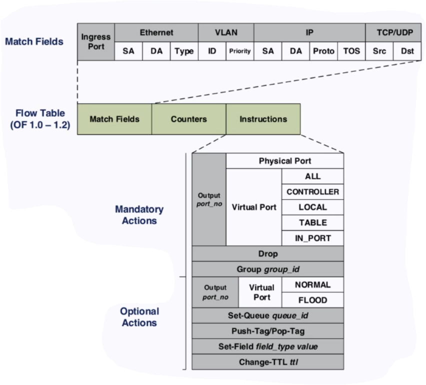

# Software Defined Networking

## Intro
### What is SDN?

- New approach to networking
    - Manage and implement network
- Traditional Approach of networking
    - Protocol defined approach
        - HTTP, TCP, UDP, etc

### Key to Internet's success

- Hourglass IP Model
- Layered Service Abstractions
    - Internet Protocol stack
    - Each layer can evolve independently
        - without changing other layers
- ONLY for network edges
    - they only have the upper layers (e.g TCP)

### Router / Switch at the core
- Recap
    - Router: Layer 3
        - Uses IP addresses
        - Crossing between multiple local networks
    - Switch: Layer 2
        - Uses MAC address
        - Find next hop
        - Local area network
- 2 key functions
    - Run routing algorithms / protocol (RIP, OSPF, BGP)
        - More software (algos to decide paths)
    - forwarding datagrams from incoming to outgoing link
        - More hardware (which port to use)

### Control Plane vs Data Plane

- **Control Plane**: Establish router state
    - Determine where to forward packet to
    - Relative slower
    - Generally has a broader view - neighbouring systems
- **Data Plane**: Process / Deliver packets
    - Actual deliver the packet
    - Much faster
    - Less broad view: Only see local information

## Design Principles
### Principle 1: Disaggregation

- Communication between data plane and control plane should be driven by open interfaces
    - Southbound interface

#### Implications
1. Network operators can purchase control and data planes from different vendors
    - Prevent vendor lock-in
2. Data plane consists of cheaper commodity forwarding devices (bare-metal switches)
    - Decoupling data plane with control plane
3. **Forwarding Abstraction** needs to be defined
    - Choose which vendor to buy the more expensive control plane hardware

#### Benefits

- Pros
    - New market landscape & value shift
        - Shift control from vendors to operators that build networks
    - Fast innovation
        - None of the 'Cisco is slow at implementing x feature' issue
        - Software can evolve independently of the hardware

### Principle 2: Centralized Control

"1 controller for the network"
- Switches on the data plane communicate to a single controller
    - In large enough use cases, controller can be a distributed system

#### Benefits

- Centralized Decisions are easier to make
    - Less complex as you have a global view of the system
    
- Logically centralized

#### Example of forwarding abstraction: OpenFlow

Flow rule: Match-Action pair

- Match and map to action
- Apply action

#### Where to implement the control plane?

1. Run software that implements control plane on-switch
    - Switches operate autonomously
        - Have to communicate with peer switches throughout the network to construct local routing tables
2. Make control plane physically decoupled from data plane
    - Control plane is implemented off-switch
        - e.g running in cloud
    - Possible to make it logically centralized

#### How to implement the data plane

- Option 1: fixed-function data plane
    - Header fields are well-known
    - Offsets are easy to compute
    - Match fields to actions (e.g OpenFlow)
- Option 2: programmable data plane
    - Data plane providing open interfaces about their internal structure
    - Instruct the data plane to identify certain part of the package header for a newly designed protocol

### Principle 3: Programmability

#### Benefits
- Easy network management
    - Management goals as policies
    - Easier to debug
- Control shift from vendor to users
    - Rapid innovation

### Summary: Design Principles

1. Separation of Control Plane and Data Plane (Disaggregation)
2. Logically Centralized Control (Centralization)
3. Programmability 

- Modularize the network control problem into the 3 layers of abstractions.
    - Specification
        - Allow a control application to express the desired network behavior without implementing it by itself
    - Distribution
        - Shield SDN apps from the distributed state, making distributed control logically centralized
    - Forwarding
        - Allow any forwarding behavior desired by apps while hiding details of underlying hardware

## Network Operating System

- Network OS itself is the control plane
    - OS provides high level abstractions to make it easier to write appplications
    - Network control functionality implemented by control apps

### Comparison with a traditional OS

- Southbound API in x86 / OpenFlow.
- "Data Plane" is x86 CPU / OpenFlow switch
- Northbound: Applications

## Use Cases
