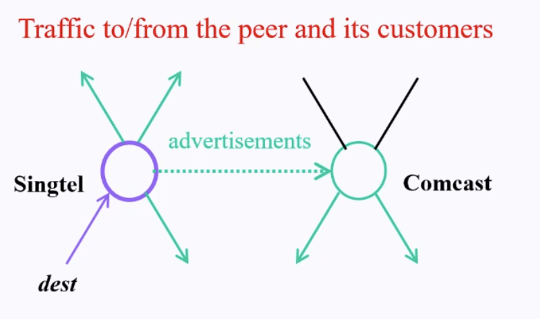

# Inter-Domain routing

- How ASes route / exchange traffic
    - **Intra-domain** routing protocol: within each AS
    - **Inter-domain** routing protocol: between AS

- Challenges:
    - Scale
    - Privacy
    - Policy

# Intra routing protocols

## 2 classes of routing algos (and why can't they work for inter-domain)

### 1. Link State
- All routes have complete topology
- All routes have link cost info
- Global or centralized
    - Based on Dijkstra's
    - Open Shortest Path First (OSPF)

#### Limitations
- Topology information is flooded
    - High bandwidth + storage overhead
    - Nodes divulge sensitive information (violates Privacy)

- Entire path computed locally per node
    - High processing overhead in large network

- Hard to find a universal metric
    - Different AS has different objectives
        - "Best route" for 1 might not be best route for another

### 2. Distance Vector Algorithm
- Route knows info of connected neighbors, link costs
- Decentralized Algorithm 
    - Based on Bellman-Ford Algorithm
    - Routing Information Protocol (RIP)

#### Better than 1?

- Hide details of network topology (no topology information flood)
- Only next hop determined by node

#### Limitations

- Slow convergence
    - RIP takes a long time to converge, especially when network is bigger (imagine the size of the internet)

- Still does not solve the universal metric / notion of total distance problem

# Path-Vector Routing: An extension to DV routing

- Solution: extend DV routing

- Key ideas: Advertise entire path
    - DV: send distance metric per destination *d*
    - PV: send entire path for each destination *d*

- Faster loop detection
    - Nodes can easily detect a loop
        - If node itself is in path = loop
            - Simply discard loop paths

# Protocol: Border Gatgeway Protocol (BGP)

- de facto inter-domain routing protocol
- runs between 2 routers

## BGP Operations

- BGP session
    - 2 BGP routers exchange messages
        - Advertise paths to different destination network prefixes
        - Runs through Layer 4 (Transport Layer) (TCP protocol)

## BGP / IGP model used in ISPs

- eBGP runs between ASes
    - exchange reachability information from neighbouring ASes
- iBGP runs within ASes
    - propagate reachability info across backbone
    - carry ISP's own customer prefixes
- IGP runs within ASes
    - Interior Gateway protocol

### eBGP: Exterior BGP Peering

- Runs between BGP speakers in different ASes
- Should be directly connected

- When AS1 advertises an IP prefix to AS2:
    - AS1 promises:
        - It will forward packets towards that prefix
        - AS can aggregate prefies in its advertisment (CIDR notation (`<ip>/<subnetmask>` e.g `192.168.1.0/24`))
            - Prefix matching possibility

### iBGP: Interior BGP Peering

- Peers within an AS
- Not required to be directly connected
    - IGP (RIP / OSPF) handles inter-BGP speaker connectivity
- iBGP peers must be (logically) fully meshed
    - iBGP speaker passes on prefixes learned from outside the AS
    - iBGP speaker **does not** pass on prefixes learned from other iBGP speakers
        - AS-PATH cannot prevent loops within a single AS, so the protocol blocks that behavior outright
        - A router that learns a prefix from outside via eBGP: propagate to rest
            - e.g A learns prefix from outside via eBGP: Propagate to B, C, D
            - But because iBGP is fully meshed, every router learns this information from A, no need to propagate

- Example here:
    - 1c recieves BGP messsage from 3a (**via eBGP**)
    - 1c distributes prefix info to all routers in AS1 (via **iBGP**)
    - 1b re-advertise info to AS2 over **eBGP**

### BGP messages

- OPEN
    - opens TCP connection to peer and authenticate sender
- UPDATE
    - advertises new paths (or withdraws old path)
- KEEPALIVE
    - keeps connection alive in absence of updates
    - also acts as an ACK for OPEN request
- NOTIFICATION
    - repors errors in previous messages
    - also used to close connection

### BGP messages: UPDATE message format

Key Observations:
- We can withdraw multiple routes in an update message
    - Specify length of withdrawn routes
- But we can only announce at most 1 new route per update message

- Network Layer Reachability Information (**NLRI**)
    - IP prefixes that can be reached from the advertised route

#### Withdrawn Routes

- No expiration timer for routes like RIP
- Invalid routes are actively withdrawn by original advertiser
    - Routes are considered available until explicitly withdrawn by announcing neighbour by:
        - Withdraw route
        - UPDATE message to replace existing route
        - Reduces amount of information exchange
- If a peer goes down, all routes from it become invalid
    - KEEPALIVE
        - No response -> assume router is down -> all routes invalid
    - NOTIFICATION
        - Connection closed -> all routes invalid

#### BGP Path Attributes
- 4 separate categories
    - well-known mandatory 
    - well-known discretionary (non mandatory)
    - optional transitive
    - optional non-transitive

- Each implementation of the BGP protocol needs to
    - Recognize all well-known attributes
    - Mandatory attributes MUST be included in UPDATE messages that contain NLRI
    - Once BGP peer updates well-known attributes, it must propagate to peers

##### Well-known mandatory attributes

- ORIGIN
    - Origin of the prefix, learned from:
        - `i` (IGP): Interior gateway protocol (RIP / OSPF) 
        - `?` (INCOMPLETE): Unknown source
        - `e` (EGP): Exterior gateway protocol (i.e BGP)
- AS-PATH
    - (It is a Path-Vector protocol after all)
    - Contains ASes through which NLRI has passed
    - Expressed as a sequence (e.g AS 78, AS 12) or a set
- NEXT-HOP
    - Indicates IP address of the router in the net-hop AS.
        - There might exist multiple links between any2 ASes
### Forwarding Table

- High level overview
    1. Router becoimes aware of IP prefix
    2. Router determines the output port for the IP prefix
    3. Router enteres the prefix-port pair in forwarding table

- BGP message contains "routes"
    - route = (destination) IP prefix + attributes: AS-PATH, NEXT-HOP
    - e.g route: `Prefix: 192.168.64.29/22; AS-PATH: AS3 AS131; NEXT-HOP: 201.44.13.125`
    - Router might recieve multiple routes for same destination prefix
        - Router has to select 1 route
            - Select best BGP route to prefix
                - Typically: Router selects route based on shortest AS-PATH
                    - e.g `AS2 AS18 AS98 to 130.16.64.29/22` vs `AS3 AS19 AS98 AS111 to 130.16.64.29/22`: Same destination prefix: select shortest route

            - What if there is a tie?
                - Typically: Best intra-domain routing cost (**Hot Potato Routing**)
                    - Choose route with closest NEXT-HOP
                    - Use selected route's NEXT-HOP
                        - IP addr of the router interface that begins the AS PATH
                        - e.g:
                        - Router uses OSPF to find shortest path from 1c to `111.99.86.55`
                        - Router selects shortest OSPF path, adds prefix-port entry to the forwarding table: `192.168.64.29/2, port 4` (destination prefix, port to next-hop node with shortest path)

#### Forwarding Table: Summary

1. Router becomes aware of prefix
   * via BGP route advertisements from other routers

2. Determine router output port for prefix
   * choose the best inter-AS route from BGP
   * use OSPF to find best intra-AS route leading to best inter-AS route
   * identify port number for the best route

3. Enter prefix-port entry in forwarding table

### BGP Routing Information Bases

- A route in a BGP speaker is:
    - prefix + attributes = NLRI + Path Attributes

- All routes in a BGP speaker is:
    - Routing Information Bases (RIBs)
    - RIB is the sum of the following:
        - Adjacent RIBs In
            - Unprocessed routes from peers via an inbound UPDATE
            - Input for decision making
        - Local RIB
            - Selected local routes used by the router
        - Adjacent RIBs Out
            - Selected for advertisment to peers

### BGP Decision Process: Policy-based routing framework

- Each AS has its own freedom to implement the following, based on its own criteria
    - Apply Import Policies
        - Filter unwanted routes from neighbour
            - e.g Customer advertises a prefix that it does not own
        - Rank customer routes over peer routes
        - Manipulate attributes to influence path selection
            - e.g assign local preference to favoured routes
    - Apply Export Policies
        - Filter routes you don't want to tell your neighbour
            - e.g export only customer routes to peers & providers
                - Since they make money of traffic send to customers
        - Manipulate attributes to control what they see
            - e.g Artificially make paths look longer (AS prepending)
                - e.g `AS5 AS1 AS3 -> AS5 AS5 AS5 AS5 AS1 AS3`
    - Best Route Selection

#### BGP Policy: In practice

- Commercial ISP
    - Fulfill bilateral agreements with other ISPs
    - Minimize monetary cost / Maximize revenue
    - Ensure good performance for customers

- Bilateral agreement between neighbour ISPs
    - Defines who provides transit for what
    - Depends on business relationship

### Customer-Provider Relationship: Extension

1. Customer pays provider for access to internet
    - Provider exports customer's routes to everybody
        - Entire internet can reach customer / customer's customers, etc
    - Customer export provier's routes to customers
        - Allows its own customers to use the upstream

### Peer-to-Peer relationship

1. Peers exchange traffic between customers
    - AS exports only customer routes to a peer
    - AS exports a peer's routes only to its customers
    - So that customers of 1 AS can transit traffic to customer of another AS through the peering link

