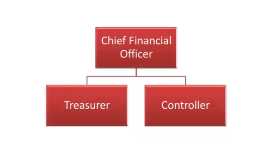
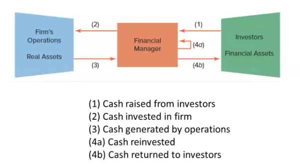

# Corporate Governance & Agency Problem

## Investment and Financing Decisions

### Investment Decisions

_I decide to invest in Boeing 777-9 -> Investment Decision_

a.k.a Capital Budgeting Decision (Decision to invest in assets)

**Real Assets**
- Assets used to produce goods and services
    - Tangible Assets
        - Something you can touch, feel, see
        - Examples: Buildings, Machinery, Equipment

    - Intangible Assets
        - Something you cannot touch, feel, see
        - Examples: Patents, Trademarks, Goodwill, Research, etc

**Financial Assets**
- Shares, equity, etc
- Financial claims to the income generated by the firm's real assets
- Securities = bonds / stocks

### Financing Decisions

_How am I going to fund this -> Financing Decisions_

Decision on the sources and amounts of financing

Capital Structure - The mix of long-term debt and equity financing

Equity Financing
- I give you Money for ownership / profit share

Debt Financing
- Entity loans person money
- Loaner earn a fixed amount of interest
- Pay back the principal (original money borrowed)

## Corporations

Corporation
- A business organized as a separate legal entity owned by shareholders
- Shareholders elect board of directors, who appoint managers and monitor their performance / CEO
- Separate ownership and control
    - You may own shares but you don't run the company
    - The CEO runs the company

Types of corpos
- Public Companies
    - Traded in public markets
- Private Corporations
    - Closely held by a small group of investors

Types of business Organizations
- Sole Proprietorships: Owned and controlled by an individual (e.g I own a restaurant)
- Partnerships: Owned and controlled by >= 2 people
- Corporations
- Others
    - Limited Liability Partnerships or Limited Liability Companies (LLCs):
        - Limited liability
        - No double taxation
    - Professional Corporations: Corporation with Limited liability
        - Professionals can be sued for malpractice
        - Shareholders but do the work too (e.g 5 dentists open a clinic)

Limited Liability
- Owners of a corporation are not personally liable for its obligations
- If you own the company shares, the maximum you can lose is your initial investment

## Financial Manager

Treasurer
- Looks at the future
- Go to banks, establish agreements to borrow money

Controller
- More like accountant
- Prepare financial statements

## Goals of the Corporation

Shareholders desire wealth maximization
- Maximize current market value of shareholder's investment in the firm

Why not profit maximization?
- Earning manipulation (BAD)
    - Maximize current year's earnings at the cost of future income

Opportunity Cost of Capital
- Minimum acceptable rate of return on capital investment
- _"If you can't make this amount of money, you better return to them as a dividend"_

## Agency Problem

Do managers maximize shareholder wealth or manager wealth?

Managers have many constituencies called "Stakeholders"
- Anyone with a finalcian interest in the corpo
- Agency problem
    - Managers are agents for stockholders
    - Tempted to act in their own interests rather than shareholder value
    - e.g paying employees more going against stakeholders wishes (of profit)
- Agency cost
    - Value lost from agency problems / mitigating agency problems

### How to deal with the issue?

Executive Compensation
- Annual award tied to earnings / financial performance beasure)
- Instead of 100% base salary
- Stock options as part of package
    - Option to buy a share at a 'strike price' (fixed amount of money)

Corporate Governance
- Laws, regulations that protect shareholders and other investors
- Elements of good corporate governance
    - Legal Requirements
        - Annual reports, quarterly reports
    - Board of directors
        - Decision with them
    - Activist shareholders
        - Use rights as a shareholder to put pressure on corpo
    - Takeovers
        - Share price drops, other company buys you out
        - Fire CEO
    - Information for investors (Accounting and reporting standards)

### Ethics of Maximizing value

Does value maximization justify unethical behavior
- Short selling
    - You want the share price to drop down
    - Sell and wait for share price to drop to rebuy
- Corporate Raiders
- Tax avoidance