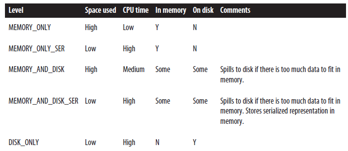

# Apache Spark

## RDD (Resilient Distributed Dataset)

### Overview

RDDs are Spark's core abstractions for working with data.
- They are simply an immutable distributed collection of objects
    - A RDD internally is split into multiple **partitions**
        - Each partition can be computed on different clusters / nodes
    - Can contain any object
        - `JavaRDD<T>` in Java
- Works similarly to streams, where all work is chained.
    - 2 types of operations
        - Transformations
            - RDD -> RDD
        - Actions
            - RDD -> Not RDDs
    - Computed lazily, only evaluated when it is used in an action.
        - Similar contrast between `Stream` and `ArrayList` where memory is saved by not eagerly loading everything into memory.
        - Content of RDDs after computation can be stored in memory (or disk).
        - but are by default recomputed each time you run an action on the RDD

### Creating RDDs

2 Main ways of creating RDDs
- Loading an external dataset
    - More common for enterprise applications
        - Example: `sc.textFile("/path/to/file.md")`
- Paralellizing a collection in the program
    - `parallelize(list here)`
        - Java: `Arrays.asList("pandas", "i like pandas")`
        - Python: `["pandas", "I like pandas"]`
        - etc.
    - Not very applicable in enterprise applications since that requires your whole dataset to be in one machine
    - Good for learning though, since you can initialize a basic RDD and do stuff on it.

### Working with RDDs: Operations

As mentioned in [Overview](#overview), there are 2 types of operations on RDDs.

#### Transformations

Transformed RDDs are:
- Computed lazily
- Operates on 1 or more RDDs
    - `filter` takes in 1 RDDs
    - `union` takes in 2 RDDs
        - Pseudo-set operations are supported (like `intersection`, `union`, `subtract`, `cartesian`)
- Mostly element-wise (work on 1 element at a time)
    - Not all though.
- Use `flatMap` if you want to do a 1 to many mapping. (Returns `RDD<Type>` instead of `RDD<List<Type>>`)
- Examples:
    - Java: `exampleRDD.filter((String x) => x.contains("Java"))`
    - py: `exampleRDD.filter(lambda x: "Python" in x)`

The existing RDD is not mutated (**remember that RDDs are immutable**). A transformation simply returnsa pointer to an entirely new RDD.

Spark also keeps track of the transformations via a _lineage graph_
- Compute each RDD on demand
- Helps recover lost data

#### Actions

Return a final value  to the program / write data to external storage

- **Forces evaluation of transformations required for the RDD**, since they need to produce output.
- Examples:
    - `foreach`
        - Applies funtion to each element of the RDD. Returns nothing
    - `count`
        - Returns number of elments in RDD
    - `take(int)`
        - Takes first n elements
    - `collect`
        - Returns all elements from the RDD
        - That also means all the RDD content is expected to fit inside memory
        - Commonly used in unit tests to easily compare RDD values to expected values.
    - `reduce`
    - `fold` (Remember `accumulate` in CS1101s?)
        - `fold` is just `reduce` with a seed (a.k.a start with 0 for + or 1 for *)
    - `aggregate`
        - `aggregate` is different from `reduce` or `fold` as the input and output for the accumulation function does not have to be the same type.
            - e.g you want both the sum and count of a RDD. You can just use a pair `(sum, count)` in `aggregate` and supply:
                1. A function that adds an element to an accumulator (e.g py `lambda acc, value: (acc[0] + value, acc[1] + 1)`)
                2. A lambda that adds 2 accumulators together (e.g py `lambda acc1, acc2: (acc1[0] + acc2[0], acc1[1] + acc2[1]`)
- Note that every time an action is called, the entire RDD is recomputed by default.
    - [persistency](#persistence) can be toggled to prevent such behavior.

#### Converting between RDD types

Some functions are only available on RDDs of certain types
- e.g `mean()` and `variance()` on numeric RDDs / `join()` for Key/value pair RDDs.

How it behaves differs between prog langs
- `Scala`: Implicitly handled
    - Must `import org.apache.spark.SparkContext._`
- `Java`: Explicitly converted
    - e.g conversion to `DoubleRDD`: Instead of `Function<T, Double>` with `map()`, you supply `DoubleFunction<T>` using `mapToDouble()` 
- `Python`: Operation simply fails at runtime if incompatible

### Persistence
RDDs in spark are lazily evaluated.
- There are cases where you want to use the same RDD multiple times
    - Default behavior: Spark recomputes the RDD and all its dependencies each time you call an action
        - Very expensive!
    - In this case, we can ask Spark to persist the data via:
        - `rdd.persist(STORAGE_LEVEL)`
            - Note that `persist()` does not force evaluation.
        - The nodes that compute the RDD store their partitions.
            - That means, if the node that has data persisted on it fails, Spark will recompute the lost partitions when necessary.
        - Storage Levels: 
        - If the user attempts to cache too much data in memory, spark will evict old partitions using LRU cache policy.
            - If purely memory, partitions are recomputed when they are accessed.
            - If memory-disk, old partitions are written to disk.

## Special RDDs

Briefly touched on earlier, but there are some RDDs of certain types that Spark provides special operations on, and we will be covering them in the next section.

### Key/Value pair RDDs (Pair RDDs)

Common in aggregation functions.

Often initial ETL (**E**xtract, **T**ransform, **L**oad) is done to convert the data into a Key/Value format.

Useful in many programs
- Example uses:
    - Act on each key in parallel
    - Regrouping data across network

#### Creating Pair RDDs

From a regular RDD:
- py and Scala: `map()` function into a (key, value) tuple.
- Java: No tuples. PairRDD is of type `JavaPairRDD<(key), (value)>`
    - Spark uses `scala.Tuple2`
        - Instantiated using `new Tuple2(e1, e2)`
        - Key: accessed using`._1()`
        - Value: accessed using`._2()`
    - Call `mapToPair(func)`, where func is of the class `PairFunction<(pdd type), (key type), (value type)>`

From an in-memory collection:

- py and Scala: `SparkContext.parallelize()` on a list of tuples
- Java: `SparkContext.parallelizePairs()` on a list of `Tuple2`s.